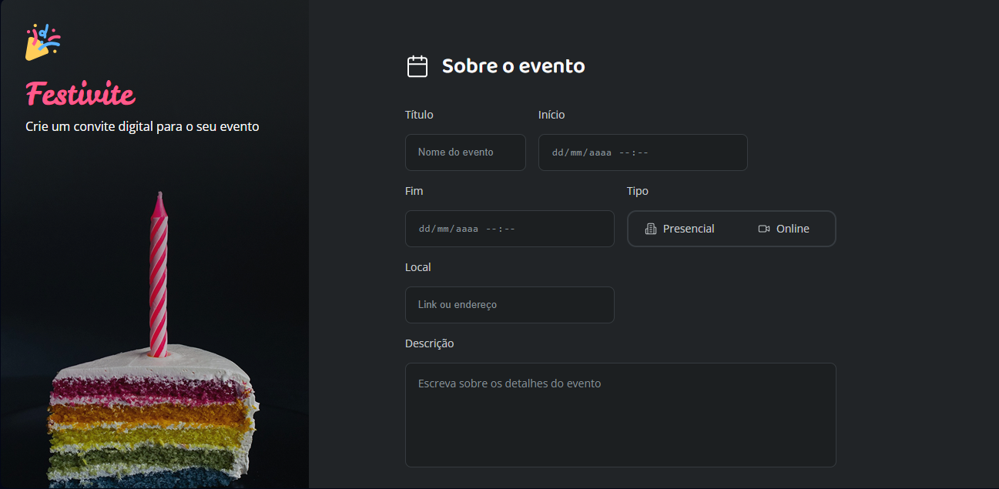

# 💻 Portal de Notícias

Este projeto tem como objetivo criar um formulário de convite para praticar e aprimorar fundamentos de **HTML** e **CSS**, aplicando conceitos de layout e formulários.

---

## 🚀 Tecnologias Utilizadas
- 
- 

---
## 📌 Layout
O layout deste projeto foi baseado em um design do [Figma](https://www.figma.com/community/file/1389649528880849780) 🌟